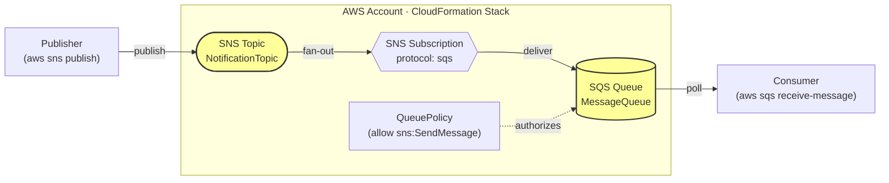

# Ejercicio Propuesto - AWS CloudFormation

Despliegue de un patrón **pub/sub** mínimo en AWS usando CloudFormation:

- **Amazon SNS Topic** — recibe los mensajes publicados.
- **Amazon SQS Queue** — suscrita al topic; recibe cada mensaje publicado.

Se incluye una `AWS::SQS::QueuePolicy` que autoriza a SNS a entregar mensajes a la cola, y una `AWS::SNS::Subscription` que conecta ambos recursos.

## Recursos creados

| Recurso | Tipo CloudFormation |
|---------|---------------------|
| Topic SNS | `AWS::SNS::Topic` |
| Queue SQS | `AWS::SQS::Queue` |
| Policy de la cola | `AWS::SQS::QueuePolicy` |
| Suscripción topic→queue | `AWS::SNS::Subscription` |

> Los **2 recursos principales** del entregable son **SNS Topic** y **SQS Queue**. La policy y la subscription son recursos de soporte para que la integración funcione.

## Diagrama de arquitectura



> Los nodos resaltados (Topic y Queue) son los **2 recursos principales** del entregable.

## Región del despliegue

El despliegue está fijado a **`us-east-1`** vía el parámetro `Region` en `parameters.json`. La plantilla usa una `Rule` de CloudFormation que **falla el despliegue si el flag `--region` de la CLI no coincide** con el parámetro — así la región queda documentada y verificada.

Para cambiar la región: actualiza el valor en `parameters.json` (debe estar en `AllowedValues`) y pasa el mismo valor en `--region` al desplegar.

## Prerrequisitos

- AWS CLI v2 configurado (`aws configure`)
- Credenciales con permisos para SNS, SQS y CloudFormation

## Despliegue

### 1. Validar la plantilla

```bash
aws cloudformation validate-template --region us-east-1 --template-body file://template.yaml
```

### 2. Crear el stack

```bash
aws cloudformation create-stack \
  --region us-east-1 \
  --stack-name iac-aws-sns-sqs-jbreategui \
  --template-body file://template.yaml \
  --parameters file://parameters.json \
  --tags Key=Module,Value=M04 Key=Class,Value=S02
```

### 3. Esperar a que termine

```bash
aws cloudformation wait stack-create-complete --region us-east-1 --stack-name iac-aws-sns-sqs-jbreategui
```

### 4. Ver outputs

```bash
aws cloudformation describe-stacks \
  --region us-east-1 \
  --stack-name iac-aws-sns-sqs-jbreategui \
  --query "Stacks[0].Outputs"
```

## Verificación funcional

Publicar un mensaje en el topic y leerlo desde la cola:

```bash
TOPIC_ARN=$(aws cloudformation describe-stacks --region us-east-1 --stack-name iac-aws-sns-sqs-jbreategui --query "Stacks[0].Outputs[?OutputKey=='TopicArn'].OutputValue" --output text)
QUEUE_URL=$(aws cloudformation describe-stacks --region us-east-1 --stack-name iac-aws-sns-sqs-jbreategui --query "Stacks[0].Outputs[?OutputKey=='QueueUrl'].OutputValue" --output text)

aws sns publish --region us-east-1 --topic-arn "$TOPIC_ARN" --message "hola desde IaC"
aws sqs receive-message --region us-east-1 --queue-url "$QUEUE_URL" --wait-time-seconds 5
```

## Limpieza

> ## ⚠️ COMANDO DESTRUCTIVO — LEE ANTES DE EJECUTAR
>
> El siguiente comando **borra el stack completo** y todos sus recursos. Específicamente eliminará:
>
> | Recurso | Nombre |
> |---------|--------|
> | SNS Topic | `topic-dev-jbreategui-001` |
> | SQS Queue | `queue-dev-jbreategui-001` |
> | QueuePolicy | (asociada al queue) |
> | SNS Subscription | (topic → queue) |
>
> ✅ **Es seguro**: `delete-stack` solo borra recursos del propio stack, no toca nada más en tu cuenta AWS.
> ❌ **No se puede deshacer** una vez ejecutado.

```bash
aws cloudformation delete-stack --region us-east-1 --stack-name iac-aws-sns-sqs-jbreategui
aws cloudformation wait stack-delete-complete --region us-east-1 --stack-name iac-aws-sns-sqs-jbreategui
```

Verifica que se borró:

```bash
aws cloudformation describe-stacks --region us-east-1 --stack-name iac-aws-sns-sqs-jbreategui 2>&1 | grep -i "does not exist" && echo "Stack borrado ✅"
```
