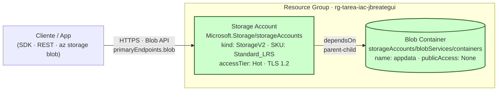

# Ejercicio Propuesto - Azure ARM Templates

Despliegue de un **Storage Account** y un **Blob Container** anidado, usando una plantilla ARM clásica (JSON).

> Nota: originalmente este ejercicio usaba Cosmos DB Serverless, pero la región `eastus` estaba saturada para Cosmos en Azure for Students y `eastus2` está bloqueada por policy. Se pivoteó a Storage Account + Blob Container, que están disponibles sin restricciones y demuestran el mismo concepto pedagógico: **patrón parent-child de ARM**.

## Recursos creados

| Recurso | Tipo |
|---------|------|
| Storage Account | `Microsoft.Storage/storageAccounts` (StorageV2, Standard_LRS, Hot) |
| Blob Container | `Microsoft.Storage/storageAccounts/blobServices/containers` |

## Diagrama de arquitectura



> El recurso `containers` es **child** del `storageAccounts` — su nombre se construye como `{cuenta}/default/{container}` y depende explícitamente de la cuenta vía `dependsOn`. El segmento `default` corresponde al `blobServices` implícito que Azure crea automáticamente.

## Prerrequisitos

- Azure CLI ≥ 2.50
- Sesión iniciada (`az login`) y suscripción seleccionada
- Resource Group `rg-tarea-iac-jbreategui` ya creado

## Despliegue

### 1. Validar la plantilla

```bash
az deployment group validate --resource-group rg-tarea-iac-jbreategui --template-file azuredeploy.json --parameters azuredeploy.parameters.json
```

### 2. Preview con `what-if`

```bash
az deployment group what-if --resource-group rg-tarea-iac-jbreategui --template-file azuredeploy.json --parameters azuredeploy.parameters.json
```

### 3. Desplegar

```bash
az deployment group create --resource-group rg-tarea-iac-jbreategui --name deploy-arm-storage --template-file azuredeploy.json --parameters azuredeploy.parameters.json
```

### 4. Ver outputs

```bash
az deployment group show --resource-group rg-tarea-iac-jbreategui --name deploy-arm-storage --query properties.outputs
```

## Verificación

```bash
# Listar la cuenta
az storage account show --resource-group rg-tarea-iac-jbreategui --name stdevjbreategui001 --query "{name:name, location:location, sku:sku.name, tier:accessTier}"

# Listar el container
az storage container list --account-name stdevjbreategui001 --auth-mode login --output table
```

En el **portal Azure**:
- Resource Group → `stdevjbreategui001`
- Tab **Containers** debe mostrar `appdata` con Public Access: Private

## Limpieza

> ## ⚠️ COMANDO DESTRUCTIVO — LEE ANTES DE EJECUTAR
>
> El siguiente comando **borra la Storage Account** y, en cascada, todos los containers, blobs y archivos que tenga adentro. Específicamente eliminará:
>
> | Recurso | Nombre |
> |---------|--------|
> | Storage Account | `stdevjbreategui001` |
> | Blob Container (child) | `appdata` (se borra automáticamente con la cuenta) |
>
> ✅ **Borrado quirúrgico**: NO se borra el Resource Group ni otros recursos que tengas adentro.
> ❌ **No se puede deshacer**. Todos los blobs almacenados se pierden.

```bash
az storage account delete --resource-group rg-tarea-iac-jbreategui --name stdevjbreategui001 --yes
```

Verifica que se borró:

```bash
az storage account show --resource-group rg-tarea-iac-jbreategui --name stdevjbreategui001 2>&1 | grep -i "not found" && echo "Storage borrado ✅"
```
