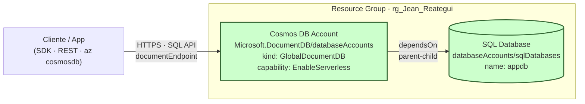

# Ejercicio Propuesto - Azure ARM Templates

Despliegue de **Azure Cosmos DB** en modo **Serverless** con una base de datos SQL anidada, usando una plantilla ARM clásica (JSON).

## Recursos creados

| Recurso | Tipo |
|---------|------|
| Cosmos DB Account | `Microsoft.DocumentDB/databaseAccounts` (capability `EnableServerless`) |
| SQL Database | `Microsoft.DocumentDB/databaseAccounts/sqlDatabases` |

> Modo Serverless: pagas por **request unit consumida**, sin throughput aprovisionado. Ideal para cargas intermitentes y para no incurrir en costos fijos durante la entrega.

## Diagrama de arquitectura



> El recurso `sqlDatabases` es **child** del `databaseAccounts` — su nombre se construye como `{cuenta}/{database}` y depende explícitamente de la cuenta vía `dependsOn`.

## Prerrequisitos

- Azure CLI ≥ 2.50
- Sesión iniciada (`az login`) y suscripción seleccionada
- Permisos para crear recursos en el resource group

## Despliegue

> Usa el resource group del lab (`rg_Jean_Reategui`). No crees uno nuevo si el lab no te lo permite.

### 1. Validar la plantilla

```bash
az deployment group validate --resource-group rg_Jean_Reategui --template-file azuredeploy.json --parameters azuredeploy.parameters.json
```

### 2. Preview con `what-if`

```bash
az deployment group what-if --resource-group rg_Jean_Reategui --template-file azuredeploy.json --parameters azuredeploy.parameters.json
```

### 3. Desplegar

```bash
az deployment group create --resource-group rg_Jean_Reategui --name deploy-arm-cosmos --template-file azuredeploy.json --parameters azuredeploy.parameters.json
```

### 4. Ver outputs

```bash
az deployment group show --resource-group rg_Jean_Reategui --name deploy-arm-cosmos --query properties.outputs
```

## Verificación

```bash
# Listar la cuenta
az cosmosdb show --resource-group rg_Jean_Reategui --name <cosmosAccountName>

# Listar las bases de datos
az cosmosdb sql database list --resource-group rg_Jean_Reategui --account-name <cosmosAccountName>
```

## Limpieza

> ⚠️ **NUNCA** borres el resource group si es el del lab — borra solo los recursos creados por este ejercicio. Cosmos DB es child→parent, así que borrar la cuenta borra también las bases de datos.

```bash
az cosmosdb delete --resource-group rg_Jean_Reategui --name <cosmosAccountName> --yes
```
