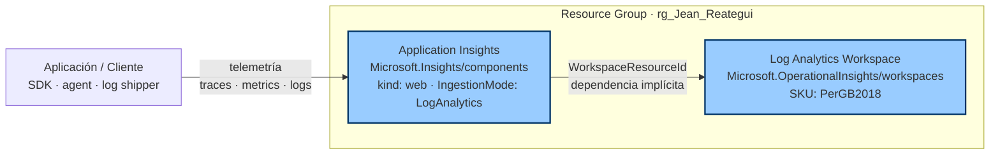

# Ejercicio Propuesto - Azure Bicep

Despliegue de un stack de **observabilidad** en Azure usando Bicep:

- **Log Analytics Workspace** — almacena logs y métricas.
- **Application Insights** — telemetría de aplicaciones, vinculada al workspace (modelo *workspace-based*).

> Nota: originalmente este ejercicio usaba App Service Plan F1/B1, pero la suscripción de laboratorio devolvía `SubscriptionIsOverQuotaForSku` para los tiers Free y Basic. Se pivoteó a recursos PaaS sin cuotas de VM. La dependencia pedagógica (App Insights → Workspace) se mantiene.

## Recursos creados

| Recurso | Tipo |
|---------|------|
| Log Analytics Workspace | `Microsoft.OperationalInsights/workspaces` (sku PerGB2018) |
| Application Insights | `Microsoft.Insights/components` (kind: web, vinculado al workspace) |

## Diagrama de arquitectura



> Bicep deduce el orden de despliegue por la referencia `WorkspaceResourceId: logAnalyticsWorkspace.id` — primero el Workspace, luego App Insights.

## Prerrequisitos

- Azure CLI ≥ 2.50 (`az --version`)
- Bicep CLI ≥ 0.24 (`az bicep version`)
- Sesión iniciada (`az login`) y suscripción seleccionada (`az account set --subscription <id>`)

## Despliegue

### 1. Validar la plantilla

```bash
az deployment group validate --resource-group rg_Jean_Reategui --template-file main.bicep --parameters main.bicepparam
```

### 2. Preview con `what-if`

```bash
az deployment group what-if --resource-group rg_Jean_Reategui --template-file main.bicep --parameters main.bicepparam
```

### 3. Desplegar

```bash
az deployment group create --resource-group rg_Jean_Reategui --name deploy-bicep-monitoring --template-file main.bicep --parameters main.bicepparam
```

### 4. Ver outputs

```bash
az deployment group show --resource-group rg_Jean_Reategui --name deploy-bicep-monitoring --query properties.outputs
```

## Verificación

```bash
# Listar el workspace
az monitor log-analytics workspace show --resource-group rg_Jean_Reategui --workspace-name log-dev-jbreategui-001

# Listar el componente App Insights
az monitor app-insights component show --resource-group rg_Jean_Reategui --app appi-dev-jbreategui-001
```

En la **portal Azure** verás en el resource group:
- 1 Log Analytics workspace
- 1 Application Insights con propiedad `Workspace` apuntando al workspace anterior

## Limpieza

```bash
az group delete --name rg_Jean_Reategui --yes --no-wait
```

> ⚠️ Si tu RG `rg_Jean_Reategui` es el del lab y tiene otros recursos, **no lo borres** — borra solo los dos creados:
>
> ```bash
> az resource delete --resource-group rg_Jean_Reategui --name appi-dev-jbreategui-001 --resource-type Microsoft.Insights/components
> az resource delete --resource-group rg_Jean_Reategui --name log-dev-jbreategui-001 --resource-type Microsoft.OperationalInsights/workspaces
> ```
