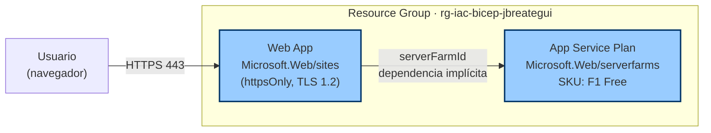

# Ejercicio Propuesto - Azure Bicep

Despliegue de una **Web App** en Azure usando Bicep, sobre un **App Service Plan** en tier **B1 Basic**.

> Originalmente F1 Free, pero las suscripciones de laboratorio suelen tener cuota 0 para Free VMs (`SubscriptionIsOverQuotaForSku`). B1 es el SKU más barato disponible y permite que el ejercicio se despliegue. Recuerda borrar el resource group al terminar para no acumular costos.

## Recursos creados

| Recurso | Tipo |
|---------|------|
| App Service Plan | `Microsoft.Web/serverfarms` (sku B1 Basic) |
| Web App | `Microsoft.Web/sites` |

> Demuestra el patrón típico Bicep con **dependencia implícita**: la Web App referencia `appServicePlan.id`, por lo que Bicep deduce el orden de despliegue sin necesidad de `dependsOn` explícito.

## Diagrama de arquitectura



> Bicep deduce el orden de despliegue por la referencia `serverFarmId: appServicePlan.id` — primero el Plan, luego la Web App.

## Prerrequisitos

- Azure CLI ≥ 2.50 (`az --version`)
- Bicep CLI ≥ 0.24 (`az bicep version`)
- Sesión iniciada (`az login`) y suscripción seleccionada (`az account set --subscription <id>`)

> Nota sobre cuotas: si tu suscripción no permite B1, prueba con `S1` (Standard) o `P1V2`. Si te sale `SubscriptionIsOverQuotaForSku`, ese SKU no está disponible en tu sub.

## Despliegue

### 1. Crear el Resource Group

```powershell
az group create --name rg-iac-bicep-jbreategui --location eastus
```

### 2. Lint + build (validación local)

```powershell
az bicep build --file main.bicep
```

### 3. Preview con `what-if`

```powershell
az deployment group what-if `
  --resource-group rg-iac-bicep-jbreategui `
  --template-file main.bicep `
  --parameters main.bicepparam
```

### 4. Desplegar

```powershell
az deployment group create `
  --resource-group rg-iac-bicep-jbreategui `
  --name deploy-bicep-webapp `
  --template-file main.bicep `
  --parameters main.bicepparam
```

### 5. Ver outputs

```powershell
az deployment group show `
  --resource-group rg-iac-bicep-jbreategui `
  --name deploy-bicep-webapp `
  --query properties.outputs
```

## Verificación

Abrir la URL devuelta en `webAppUrl` — debería mostrar la página de bienvenida de App Service.

## Limpieza

```powershell
az group delete --name rg-iac-bicep-jbreategui --yes --no-wait
```
